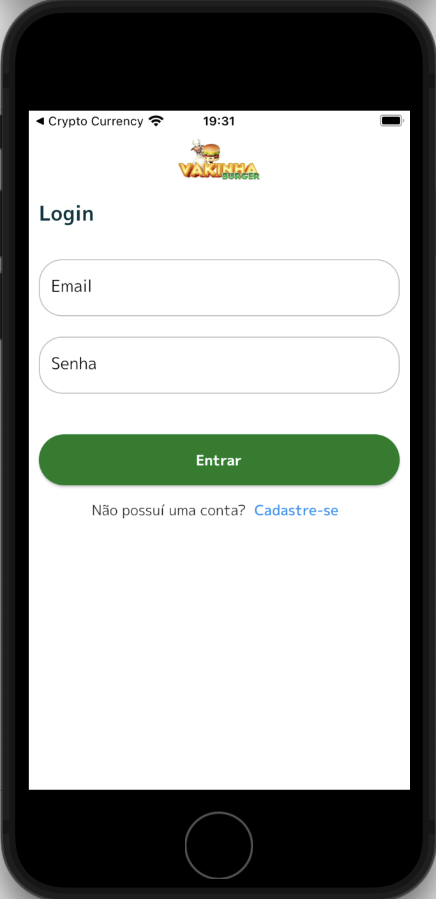
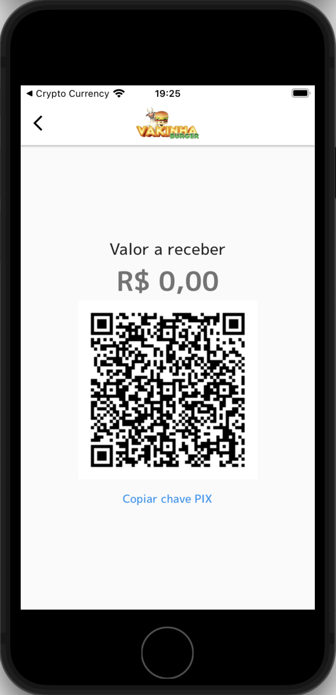

# Vakinha Burguer

Vakinha Burguer é um app desenvolvido para aprendizado de **CLEAN ARCHITECTURE**

 

Este app foi desenvolvido utilizando o **GETX**, que por sua vez é um sistema de injeção de dependências altamente poderoso no mundo do Flutter

<h2 align="center">Inicio do app</h2>

    

<h2 align="center">cadastro/autenticação</h2>

    
    

<h2 align="center">Produtos/detalhe do produto</h2>

    
    

<h2 align="center">Carrinho de compras</h2>

    
    

<h2 align="center">Pagamento</h2>

    

 

   Feito com ❤️ by <b>welitonsousa</b>

